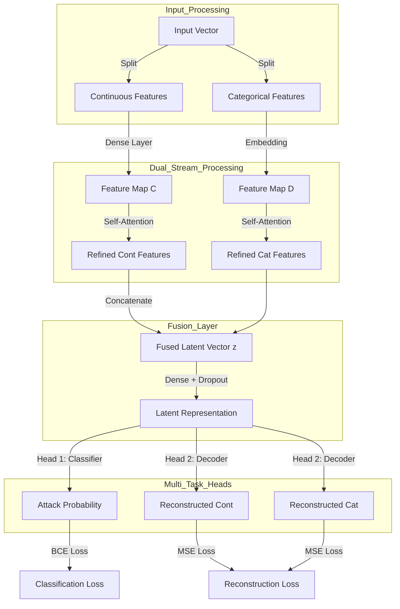

# Model Architecture & Mathematics: MT-DS-SAN

## 1. High-Level Architecture
The **Multi-Task Dual-Stream Self-Attention Network (MT-DS-SAN)** is a hybrid deep learning model designed to handle the heterogeneous nature of network traffic data (Continuous vs. Categorical). It integrates **Dual-Stream feature processing**, **Self-Attention mechanisms**, and **Multi-Task Learning** to achieve robust anomaly detection.

### 🏗️ Professional Block Diagram



---

## 2. Mathematical Formulation

### A. Dual-Stream Feature Extraction
Let an input sample $x$ be split into continuous features $x_{cont} \in \mathbb{R}^{N}$ and categorical features $x_{cat} \in \mathbb{R}^{M}$.

**1. Continuous Stream:**
The continuous features are projected to a hidden dimension $d_{model}$:
$$ h_{cont} = W_c x_{cont} + b_c $$

**2. Categorical Stream:**
Categorical features are embedded and flattened/projected:
$$ h_{cat} = W_e(x_{cat}) $$
where $W_e$ is a learnable embedding matrix.

### B. Feature-Wise Self-Attention
To capture the correlation between different feature sets irrespective of their position, we apply Scaled Dot-Product Attention:

$$ Attention(Q, K, V) = softmax(\frac{QK^T}{\sqrt{d_k}})V $$

For our streams, we treat the feature embedding as the query, key, and value ($Q=K=V=h$):
$$ \alpha_{cont} = LayerNorm(h_{cont} + Attention(h_{cont})) $$
$$ \alpha_{cat} = LayerNorm(h_{cat} + Attention(h_{cat})) $$

### C. Fusion & Latent Representation
The streams are concatenated and passed through a fusion layer to form the latent vector $z$:
$$ z = \sigma(W_f [\alpha_{cont}; \alpha_{cat}] + b_f) $$
where $\sigma$ is the ReLU activation function.

### D. Multi-Task Loss Function
The model optimizes two objectives simultaneously:

1.  **Classification Loss ($L_{cls}$)**: Binary Cross-Entropy for differentiating Normal vs. Attack.
    $$ L_{cls} = - \frac{1}{N} \sum [y \log(\hat{y}) + (1-y) \log(1-\hat{y})] $$

2.  **Reconstruction Loss ($L_{rec}$)**: Mean Squared Error to ensure feature validity.
    $$ L_{rec} = ||x_{cont} - \hat{x}_{cont}||^2 + ||x_{cat} - \hat{x}_{cat}||^2 $$

**Total Loss:**
$$ L_{total} = L_{cls} + \lambda L_{rec} $$
where $\lambda$ (lambda) is a hyperparameter balancing the two tasks (set to 0.5).

---

## 3. Algorithm: Training Procedure

**Algorithm 1: MT-DS-SAN Training**
```text
Input: Dataset D = {(x_i, y_i)}, Max Epochs E, Batch Size B, Rate lr
Initialize: Weights W randomly using Xavier Initialization

FOR epoch = 1 to E DO:
    Shuffle D
    FOR batch b in D (size B) DO:
        1. Split x into x_cont and x_cat
        2. Forward Pass:
            - Encode streams: h_c, h_d
            - Apply Self-Attention: a_c, a_d
            - Fuse: z = Fusion([a_c, a_d])
            - Predict Class: y_hat = Sigmoid(Classifier(z))
            - Reconstruct: x_rec = Decoder(z)
        
        3. Compute Loss:
            - L_class = BCE(y_hat, y)
            - L_recon = MSE(x_rec, x)
            - L_total = L_class + 0.5 * L_recon
            
        4. Backward Pass:
            - Compute gradients ∇L_total
            - Update W = W - lr * ∇L_total
    END FOR
    
    Validation:
        Evaluate on Test Set
        IF Val_Acc > Best_Acc THEN 
            Save Model Checkpoint
        END IF
END FOR
```
